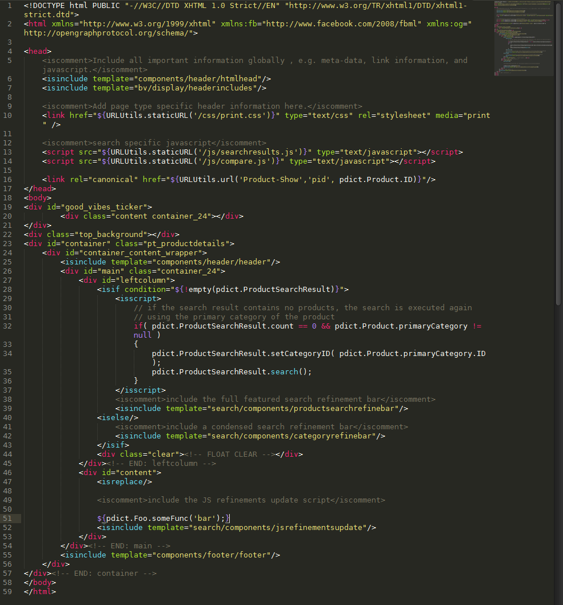

==TextMate Language Grammar for Demandware ISML==

A grammar to get nice syntax highlighting for the poor souls who have to work on Demandware ISML, yet are smart enough to not use UXStudio.

Example image:

As of now, only tested in Sublime Text 2, but should work in TextMate as well.

Essentially a modified version of the HTML language grammar.